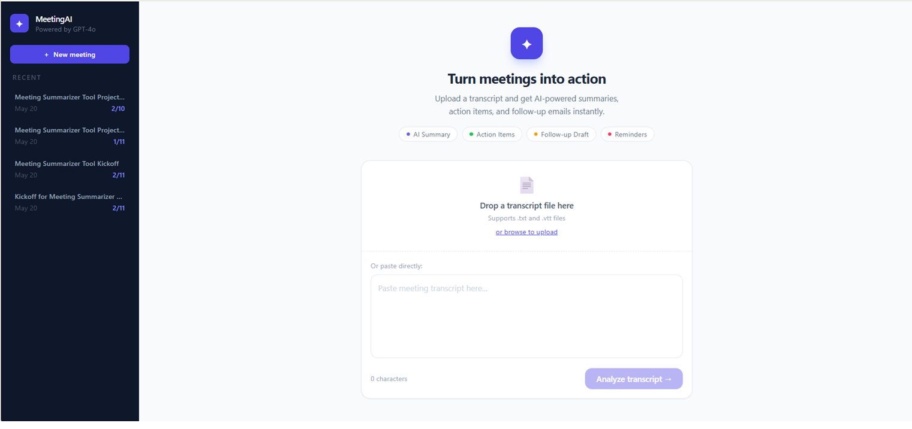
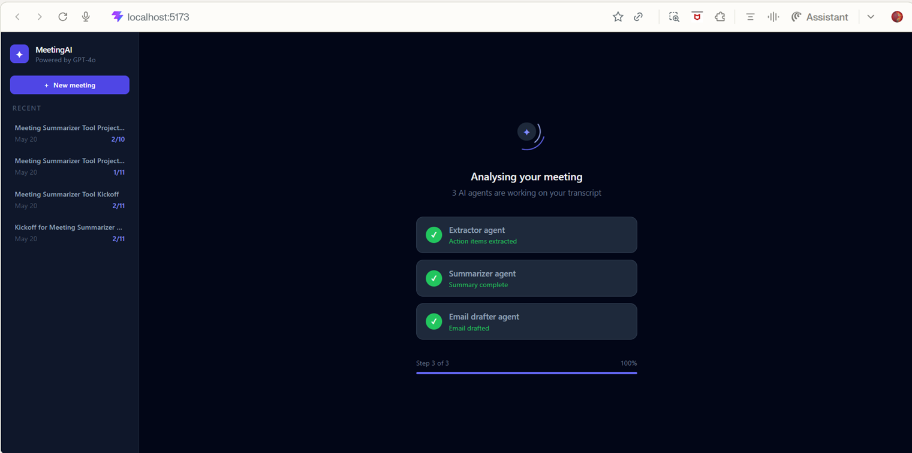
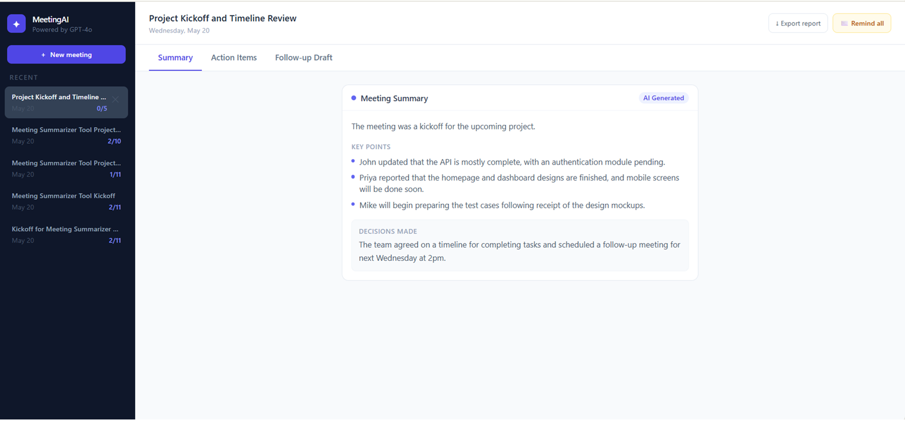
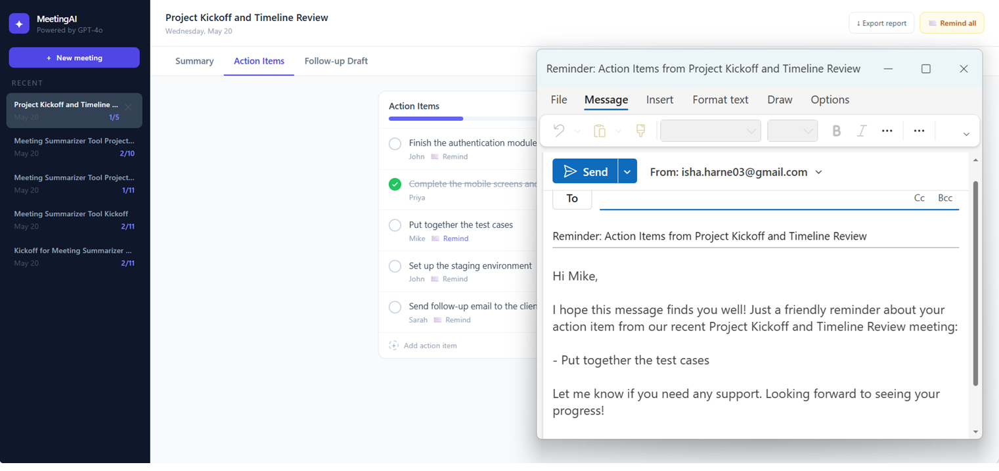
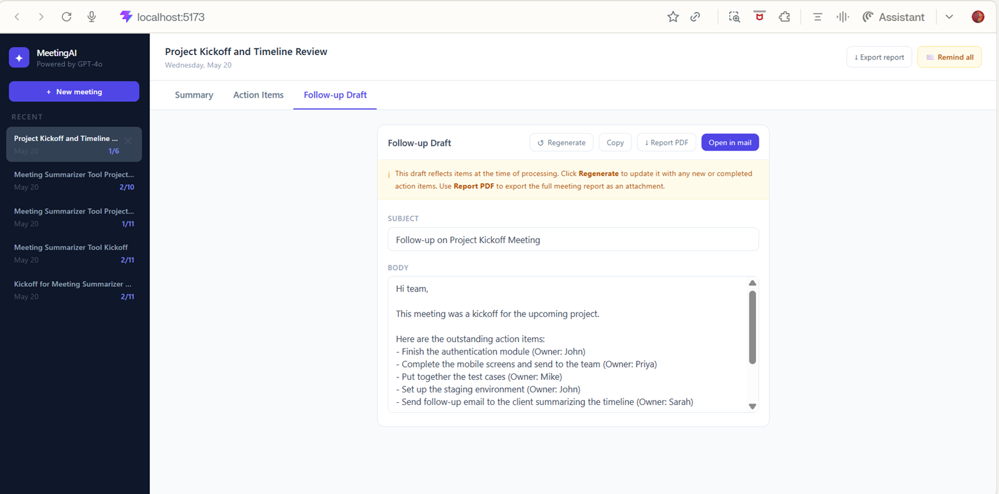

# MeetingAI — Turn meetings into action

> AI-powered meeting assistant that extracts action items, generates summaries, and drafts follow-up emails from any meeting transcript — built with a 4-agent CrewAI pipeline and GPT-4o.

## Screenshots

| Landing page | Processing screen |
|---|---|
|  |  |

| Summary tab | Action items | Follow-up draft |
|---|---|---|
|  |  |  |

---

## What it does

Paste or upload a meeting transcript and MeetingAI does the rest:

- **Extracts action items** — finds every task, commitment, and deadline mentioned, with the person responsible
- **Generates a meeting summary** — overview, key discussion points, and decisions made
- **Drafts a follow-up email** — professional, ready-to-send recap with all outstanding tasks
- **Sends individual reminders** — one-click personalised reminder email per assignee
- **Reminds the whole team** — single email listing every incomplete task grouped by owner
- **Exports a report** — clean printable PDF with the full summary and action items
- **Tracks progress** — check off items as they're completed, add new ones manually

---

## Demo

### Processing screen — 3 AI agents working in real time
The app shows each agent (Extractor → Summarizer → EmailDrafter) stepping through your transcript with live status updates.

### Results view — tabbed layout
Three tabs keep everything organised: **Summary**, **Action Items**, and **Follow-up Draft**. No scrolling through a wall of content.

---

## Tech stack

| Layer | Technology | Why |
|---|---|---|
| LLM | GPT-4o / GPT-4o-mini | GPT-4o for structured extraction, mini for text generation (cost-efficient) |
| Agent framework | CrewAI | 4 agents with distinct roles, goals, and backstories |
| Backend | FastAPI + Python | Async REST API, auto-generated docs at `/docs` |
| Database | SQLite + SQLAlchemy | Zero-setup persistence for meetings and action items |
| Frontend | React 18 + Tailwind CSS | Component-based UI with Vite build tooling |
| Deployment | AWS EC2 + Docker | Single container serving both frontend and backend |

---

## Architecture

```
Transcript input
      │
      ▼
┌─────────────────────────────────────┐
│           FastAPI Backend            │
│                                     │
│  ┌─────────────┐                    │
│  │  Extractor  │ ──► action items   │
│  │   Agent     │ ──► meeting title  │
│  └─────────────┘                    │
│                                     │
│  ┌─────────────┐                    │
│  │ Summarizer  │ ──► overview       │
│  │   Agent     │ ──► key points     │
│  └─────────────┘ ──► decisions      │
│                                     │
│  ┌─────────────┐                    │
│  │   Email     │ ──► subject        │
│  │  Drafter    │ ──► body           │
│  └─────────────┘                    │
│                                     │
│  ┌─────────────┐                    │
│  │  Reminder   │ ──► per-assignee   │
│  │  Drafter    │     reminder email │
│  └─────────────┘                    │
│                                     │
│  SQLite ──► meetings + action_items │
└─────────────────────────────────────┘
      │
      ▼
React frontend (tabbed UI + animations)
```

---

## Project structure

```
meeting-summarizer/
├── backend/
│   ├── agents/
│   │   ├── extractor.py         # GPT-4o: extracts action items + title
│   │   ├── summarizer.py        # GPT-4o-mini: generates meeting summary
│   │   ├── email_drafter.py     # GPT-4o-mini: drafts follow-up email
│   │   └── reminder_drafter.py  # GPT-4o-mini: personalised reminders
│   ├── db/
│   │   ├── database.py          # SQLite models + connection
│   │   └── queries.py           # All database read/write functions
│   ├── models/
│   │   └── schemas.py           # Pydantic request/response schemas
│   └── main.py                  # FastAPI app + all API routes
├── frontend/
│   └── src/
│       ├── components/
│       │   ├── UploadBox.jsx        # Drag-drop + paste transcript input
│       │   ├── ActionItemList.jsx   # Editable checklist with progress bar
│       │   ├── EmailPreview.jsx     # Editable draft + send/copy/export
│       │   ├── MeetingHistory.jsx   # Sidebar with delete + completion counts
│       │   ├── SummaryCard.jsx      # AI summary with key points + decisions
│       │   ├── ProcessingScreen.jsx # Animated agent progress display
│       │   └── Toast.jsx            # Notification system
│       └── App.jsx                  # Root component + all state management
├── tests/
│   └── sample_transcript.txt    # Sample transcript for testing
├── Dockerfile
└── docker-compose.yml
```

---

## Running locally

### Prerequisites
- Python 3.10+
- Node.js 22.12+
- An OpenAI API key

### Backend

```bash
cd backend
python -m venv venv

# Mac/Linux
source venv/bin/activate
# Windows
venv\Scripts\activate

pip install -r requirements.txt

# Create .env file
cp .env.example .env
# Add your OpenAI key to .env: OPENAI_API_KEY=sk-...

uvicorn main:app --reload
# API running at http://localhost:8000
# Interactive docs at http://localhost:8000/docs
```

### Frontend

```bash
cd frontend
npm install
npm run dev
# App running at http://localhost:5173
```

### Docker (single container)

```bash
docker build -t meeting-summarizer .
docker run -e OPENAI_API_KEY=sk-... -p 80:8000 meeting-summarizer
# App running at http://localhost
```

---

## API endpoints

| Method | Endpoint | Description |
|---|---|---|
| `POST` | `/meetings/process` | Process a transcript through all 4 agents |
| `GET` | `/meetings` | List all past meetings with action items |
| `DELETE` | `/meetings/{id}` | Delete a meeting and its action items |
| `PATCH` | `/action-items/{id}` | Update action item text or status |
| `POST` | `/action-items` | Add a new action item manually |
| `POST` | `/meetings/{id}/remind/{assignee}` | Generate personalised reminder email |
| `POST` | `/meetings/{id}/remind-all` | Generate team reminder with all pending items |
| `POST` | `/meetings/{id}/regenerate-email` | Regenerate follow-up draft from current items |

---

## Key engineering decisions

**Why CrewAI over a single prompt?**
Separating concerns across agents produces more reliable, higher quality output. The Extractor is tuned for structured JSON extraction. The Summarizer is tuned for neutral, concise prose. The EmailDrafter is tuned for professional communication. Each agent has a focused system prompt which reduces hallucinations compared to a single monolithic prompt doing everything.

**Why GPT-4o for extraction and GPT-4o-mini for the rest?**
Action item extraction requires precise structured JSON output — GPT-4o handles this reliably. Summarization and email drafting are text generation tasks where GPT-4o-mini performs comparably at ~10x lower cost.

**Why SQLite over PostgreSQL?**
For a single-user portfolio deployment, SQLite provides zero-setup persistence with no external dependencies. The SQLAlchemy ORM layer means swapping to PostgreSQL for production requires changing one connection string.

**Why semantic chunking wasn't needed here**
Unlike RAG pipelines, meeting transcripts are short enough to fit in a single context window. All agents receive the full transcript rather than retrieved chunks, eliminating retrieval error as a failure mode.

---

## Sample transcript

A sample transcript is included at `tests/sample_transcript.txt` for immediate testing.

---

## Live demo

🔗 [Live on AWS EC2](#) ← URL added after deployment

---

*Built by Isha Harne · [LinkedIn](https://linkedin.com/in/your-profile) · [GitHub](https://github.com/ishaharne03)*
